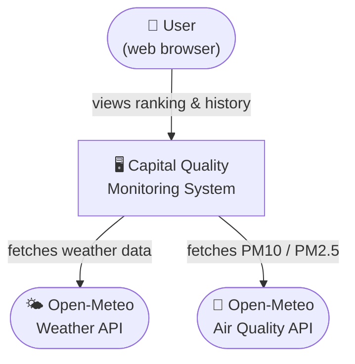
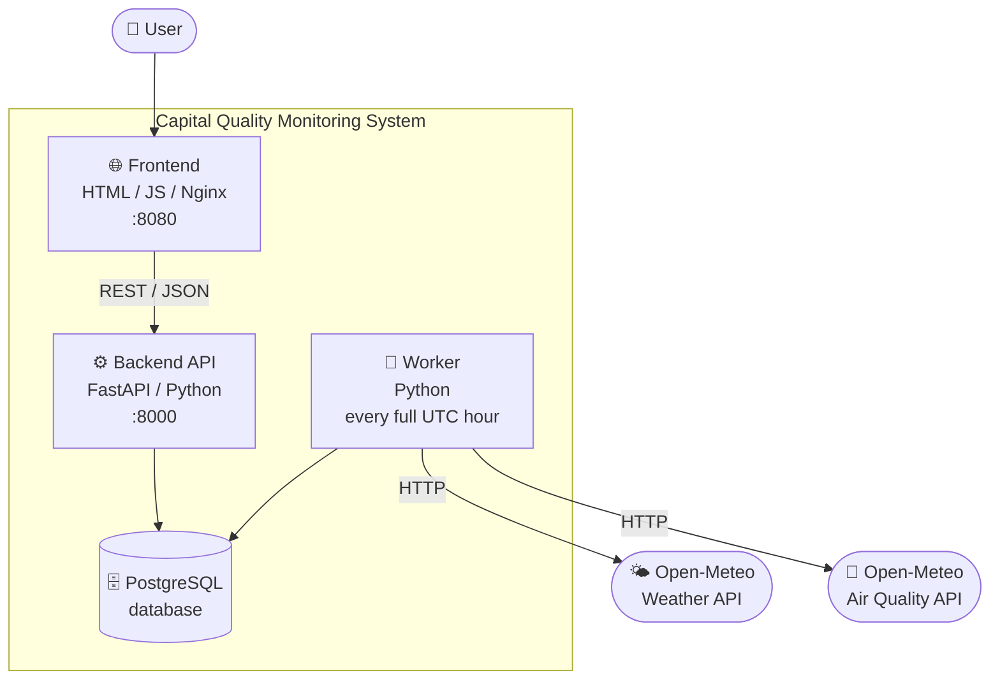
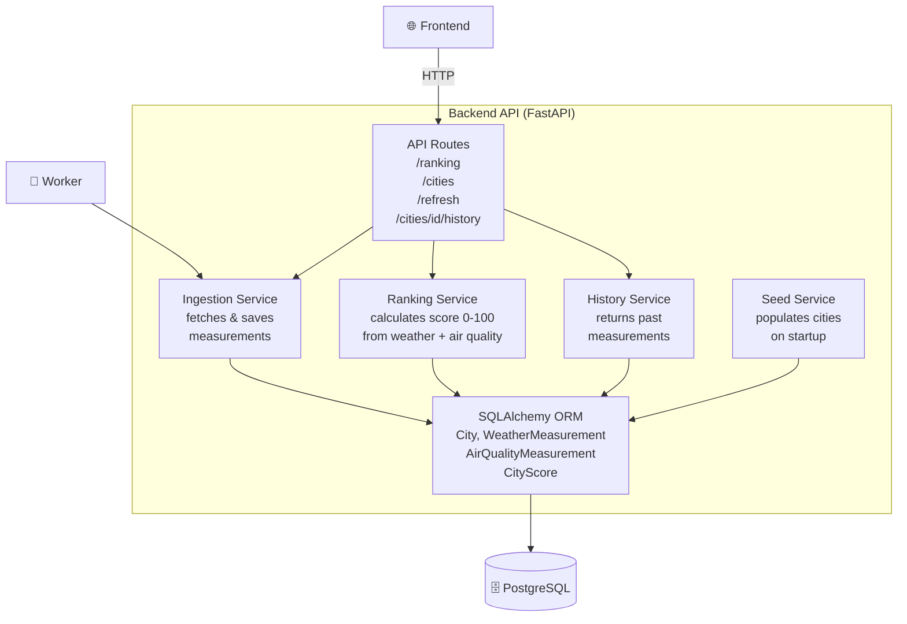

# Architecture — Capital Quality Monitoring System

## Level 1 — System Context

```mermaid
flowchart TD
    User(["👤 User\n(web browser)"])
    System["🖥️ Capital Quality\nMonitoring System"]
    WeatherAPI(["🌤️ Open-Meteo\nWeather API"])
    AirAPI(["💨 Open-Meteo\nAir Quality API"])

    User -->|"views ranking & history"| System
    System -->|"fetches weather data"| WeatherAPI
    System -->|"fetches PM10 / PM2.5"| AirAPI
```

---

## Level 2 — Containers

```mermaid
flowchart TD
    User(["👤 User"])

    subgraph System["Capital Quality Monitoring System"]
        Frontend["🌐 Frontend\nHTML / JS / Nginx\n:8080"]
        Backend["⚙️ Backend API\nFastAPI / Python\n:8000"]
        Worker["🔄 Worker\nPython\nevery full UTC hour"]
        DB[("🗄️ PostgreSQL\ndatabase")]
    end

    WeatherAPI(["🌤️ Open-Meteo\nWeather API"])
    AirAPI(["💨 Open-Meteo\nAir Quality API"])

    User --> Frontend
    Frontend -->|"REST / JSON"| Backend
    Backend --> DB
    Worker --> DB
    Worker -->|"HTTP"| WeatherAPI
    Worker -->|"HTTP"| AirAPI
```

---

## Level 3 — Components (Backend)

```mermaid
flowchart TD
    Frontend["🌐 Frontend"]
    Worker["🔄 Worker"]
    DB[("🗄️ PostgreSQL")]

    subgraph Backend["Backend API (FastAPI)"]
        Routes["API Routes\n/ranking\n/cities\n/refresh\n/cities/id/history"]
        Ingestion["Ingestion Service\nfetches & saves\nmeasurements"]
        Ranking["Ranking Service\ncalculates score 0-100\nfrom weather + air quality"]
        History["History Service\nreturns past\nmeasurements"]
        Seed["Seed Service\npopulates cities\non startup"]
        ORM["SQLAlchemy ORM\nCity, WeatherMeasurement\nAirQualityMeasurement\nCityScore"]
    end

    Frontend -->|"HTTP"| Routes
    Worker --> Ingestion
    Routes --> Ingestion
    Routes --> Ranking
    Routes --> History
    Ingestion --> ORM
    Ranking --> ORM
    History --> ORM
    Seed --> ORM
    ORM --> DB
```
